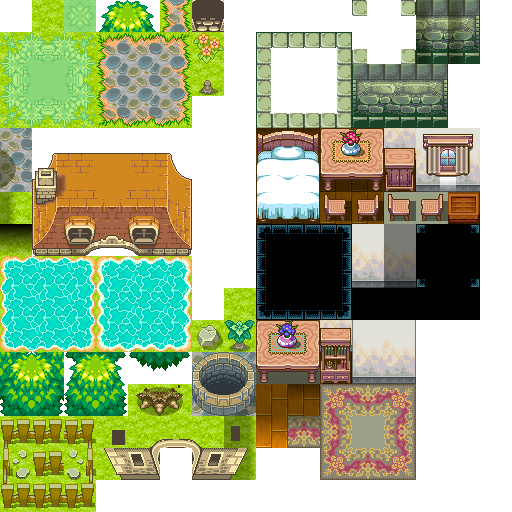

# Mandas Java Tiled2D Engine & GourdGame

Made by PandaAwAke, Nanjing University, November 2021.

## Preface

本仓库包含：

* 一个非常**简易**的 2D Tile Map 游戏引擎 (com.mandas.tiled2d)；
* 用它制作的葫芦娃泡泡堂游戏 (com.pandaawake.gourdgame)。

起因是《Java高级程序设计》课程的作业5，根据游戏编程需求干脆写个引擎帮忙罢了。


## Mandas Java Tiled2D Engine

### 简介

该引擎不依赖于您的游戏设计。

结构组成（下述被 * 标记的类不是引擎运行必须的）：

* 包 com.mandas.tiled2d.core
  * Application：全局类，会更新整个游戏；
  * GameApplication：一个接口，在使用 Mandas 之前必须定义一个类实现它，描述游戏逻辑；
  * MainWindow：窗口类，它创建一个窗口，可以自定义标题、大小等；

* 包 com.mandas.tile2d.renderer
  * Renderer：渲染器，基于 JPanel、Graphics (最早借用并改写了 AsciiPanel，后来重写了一个版本)，使用它来在窗口上画出游戏画面
  * Texture：材质，包装一个 BufferedImage，提供缩放等功能
  * TileFileParser *：解析一个 Tiled 图片，获取某个位置的 Texture。如下例所示
    
  * TileTextures *：描述了一组有顺序的 Texture，可以作为游戏中某个可绘制对象的成员存储材质表示

* 包 com.mandas.tile2d.utils
  * Pair<A, B>：描述二元对（内容可变）
  * IntPair：二元整数对，含 compareTo 方法
  * FloatPair：二元浮点数对，含 compareTo 方法

* com.mandas.tile2d.Config
  * 描述引擎的各项数据设置，比如版本号，帧率等

如上所述，Mandas 包含了引擎的基本功能，比如创建绘制环境并不断更新游戏等；但有太多功能暂未实现。而且真正的游戏引擎基于 OpenGL, Vulkan, Direct3D 等 Graphics API 实现跨平台与高效绘制，但我仅仅使用了 Graphics。以下可能是一些未来会加入的机制（取决于我是否有兴趣继续开发以及是否有开发的需要）

* Event 机制，用于捕获并传递各种键盘鼠标事件；
* 音效系统；
* 矩阵变换操作；
* Camera 与更大的场景显示；
* ……


### 快速上手

想要使用 Mandas Java Tiled2D Engine？跟随我一起完成简单的上手吧！

1. 将 com.mandas.tiled2d 导入您的 java 项目目录中，并修改 Config 类的参数，以满足您的需求；

2. 创建您的游戏项目代码包，假定包名为 com.example.game；

3. 创建您的游戏主逻辑类，要实现接口 com.mandas.tiled2d.core.GameApplication，如下：

   ```java
   package com.example.game;
   
   import com.mandas.tiled2d.core.GameApplication;
   
   public class ExampleGameApp implements GameApplication {
       
       ...
       
       public ExampleGameApp() {
           // 初始化 Renderer
           ...
       }
       
       @Override
       public void InitRenderer() {
           Renderer.Init(...);
           ...
       }
       
       @Override
       public void OnRender() {
           ...
       }
       
       @Override
       public void OnUpdate(float timestep) {
           ...
       }
       
       @Override
       public void OnKeyPressed(KeyEvent e) {
           
       }
       
       ...
   }
   ```

   需要解释的是，在您完成 Mandas 引擎的 Config 中的帧率设置后，在每一帧绘制前会调用您上面代码中的 OnUpdate 方法，然后调用您上面代码中的 OnRender 方法。

   * InitRenderer()：稍后再说；
   * OnRender()：在这个函数中，使用 Mandas 的 Renderer 对象完成绘制相关的操作（稍后见）；
   * OnUpdate(float timestep)：在这个函数中，完成您游戏随时间流逝发生的变化操作。timestep 是距离上次 OnUpdate 调用过了多少**秒** (精确到千分位，也就是毫秒级别)；
   * OnKeyPressed(KeyEvent e)：捕捉按键事件，由于 Mandas 暂时没有 Event 系统，所以将就一下（摆烂）

4. 进行 Renderer 相关初始化 InitRenderer()
   您必须在这个函数中调用 Renderer.Init(...)，指定如下内容：

   - 显示区域的宽度和高度分别是多少个 Tile；
   - 一个 Tile 的宽度和高度分别是多少像素；
   - 计分板的宽度（计分板为游戏显示区域右侧多出来的部分），如果不需要您可以设置成0；
   - 缺省默认材质/颜色 (emptyTexture)，即如果地图中有某些位置没有设定显示什么内容，就显示这个 Texture 或者这个颜色。

5. 创建 main 函数入口
   下面是一个标准的 main 函数入口，按理来说您不需要在函数体内进行其他操作。

   ```java
   package com.example.game;
   
   import com.mandas.tiled2d.core.Application;
   
   public class Main {
   
       public static void main(String[] args) {
           ExampleGameApp gameApp = new ExampleGameApp();
           Application application = new Application(gameApp, "窗口标题");
   
           application.createWindowAndRun();
       }
   
   }
   ```

   当然，您可以使用其他方式获取您的 gameApp，并用它创建 Application 单例。


OK！这就成功了。

接下来，简单介绍一下 Renderer。


### Renderer

| 方法名                          | 描述               |
| ------------------------------- | ------------------ |
| 静态方法 Renderer.getRenderer() | 获取 Renderer 单例 |

Renderer 共有三种绘制类型：固定 Tile 绘制，浮空 Tile 绘制，Scoreboard 绘制

* 固定 Tile 绘制

  Renderer 的*固定 Tile 绘制* 面向 Tiled 2D Game 地图，一切操作基于显示区域中的 Tile。比如，地图可以是 15*15 的 Tiles 组成的，每个 Tile 的宽度和高度可以是 32。

  坐标 (0, 0) 代表**左上角**的那个 Tile，(x, y) 中，x 代表横坐标，y 代表纵坐标。

  为了节省开销，只要地图某一点的材质没有发生改变，那么它就不会被重画。

  | 方法名                                                       | 描述                                                         |
  | ------------------------------------------------------------ | ------------------------------------------------------------ |
  | 静态方法 Renderer.getRenderer()                              | 获取 Renderer 单例                                           |
  | clear()                                                      | 将整个显示地图区域设置成 emptyTexture                        |
  | setTexture(Texture texture, int x, int y)                    | 设置地图位置 (x, y) 显示的材质为 texture                     |
  | addRepaintTilePositions(Collection<IntPair> repaintPositions) | repaintPositions 中的所有位置都将在下一次重画（仅重画一次，如还需重画则需重新添加） |

* 浮空 Tile 绘制
  这种绘制方式面向您游戏中的 Sprites，当然 Sprites 的显示也是基于 Tile 的。

  | 方法名                                                       | 描述                                                         |
  | ------------------------------------------------------------ | ------------------------------------------------------------ |
  | addFloatingTile(FloatPair position, Texture texture, boolean repaintNearTiles) | 添加浮空 Tile 绘制，支持自由的浮点数位置 (位置的单位仍然是一个 Tile，比如(0.5, 0))，需要指定是否需要重画周围的固定 Tile (默认重画)。<br />需要注意的是这个函数只会绘制一次，如需一直绘制则需在每次绘制前调用它。 |

  其实上面固定 Tile 绘制的 addRepaintTilePositions() 方法很好用，如果您在游戏中移除了一个 Sprite，那么需要重画它周围的固定 Tile，否则可能会残留 Sprite 的图像。

* Scoreboard 绘制
  这种绘制方式面向游戏右侧的计分板。如果您指定了计分板的宽度大于0的话。

  | 方法名                                                       | 描述                               |
  | ------------------------------------------------------------ | ---------------------------------- |
  | clearScoreboard()                                            | 清空计分板                         |
  | drawScoreboardString(int startX, int startY, String string, Font font) | 在计分板指定位置写字，可以指定字体 |
  | drawScoreboardTile(int startX, int startY, Texture texture)  | 在计分板指定位置画材质             |


### 其他

引擎中还有不少辅助函数/辅助类可供使用，GourdGame 基本全面地使用了引擎的一切，可供参考。